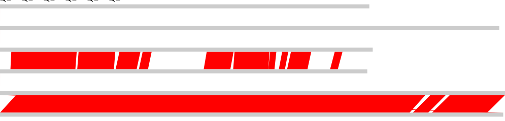

ggcb
==============
--------------
Overview
--------
Phage comparative genomics often involves alignment of several genomes at the nucleotide sequence level.
While this task is far from trivial, it can be simplified by using synteny maps.
Here we present two scripts that perform nucleotide comparisons using [BLASTn](https://pubmed.ncbi.nlm.nih.gov/10890397/).
The main script parses the BLASTn or tBLASTx output and constructs synteny maps showing blocks of sequence similarity among the compared phage genomes
First it compares the specified genomes in pairs using either BLASTn or tBLASTx, then genomes are drawn using the svg format and blocks of sequence similarity are placed connecting both genomes and color coded according to the alignment e-value. If a GenBank file is provided, genes are drawn around the genome blocks.

**Installation**:
-----------------
Edit the second line of `ggcb.sh` from `bin_dir="/usr/local/bioinformatics/local_scripts"` to a directory in which the scripts are goint to reside, such directory must be in your `$PATH`, then put the scripts `ggcb.sh` and `build_gen_map.sh` in the aforementioned directory and give them execution permissions:
```bash
chmod 775 ggcb.sh build_gen_map.sh
```

BLASTn and xmllint must also be installed and available in your `$PATH`

For editing purposes, the font [Source Code Pro](https://fonts.google.com/specimen/Source+Code+Pro) should be installed in your system.

**Usage**:
----------
* Sequences are expected to be in the genbank or fasta format, and a file of filenames is expected to perform the genome comparisons in a specified order.
  * Naming convention: fasta files containing just the accession number are preferred
* The user can specify whether BLASTn or tBLASTx is used for the comparisons. BLASTn is recommended for closely related species, whereas tBLASTx could detect synteny among more distantly related species
* The user can specify thresholds for the e-values and length of BLAST alignments

The most basic syntax is this, in which ggcb.sh search for the genome files specified in the genome_order and outputs two files, a tab separated file containing the alignment details and a scalable vector graphics file with the syntenic blocks shared between the compared genomes

```bash
cat genome_order
JF939047.fasta
JQ067084.fasta
JQ067092.fasta
KR537871.fasta
KX129925.fasta
KX898399.fasta
```

BLASTn usage
```bash
ggcb.sh blastn 1e-10 50 genome_order
```
tBLASTx usage
```bash
ggcb.sh tblastx 1e-10 50 genome_order
```

After the run, two files are generated: full_blastn_comparison.svg and full_blastn_comparison.tsv (or their tblastx counterparts). The tsv file can be further processed using *nix tools and the svg file can be further processed using inkscape or adobe illustrator.

```bash
head full_blastn_comparison.tsv
KR537871	JQ067092	1211	1311	8740	8895	0.0	3303	7661
KR537871	JQ067092	8957	9115	13209	13371	0.0	2071	4297
KR537871	JQ067092	27044	27199	31114	31253	0.0	1756	4122
KR537871	JQ067092	23626	23974	26711	27088	0.0	1426	3138
KR537871	JQ067092	33297	33745	35652	36096	0.0	1064	2373
KR537871	JQ067092	13408	13855	15842	16287	0.0	766	2472
KR537871	JQ067092	31113	31334	31829	32050	0.0	420	721
KR537871	JQ067092	38280	38823	39175	39720	3.01e-180	339	917
KR537871	JQ067092	32336	32725	33042	33435	4.00e-159	301	725
KR537871	JQ067092	16107	16547	17160	17587	6.75e-152	288	1071
```


